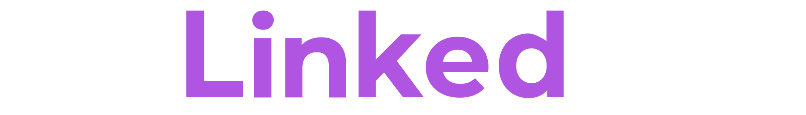

# LinkedList

<a href="#">
<p align="center">

</p>
</a>
<p align="center">
  <strong>The one stop solution to managing all your social media influence on a single platform.</strong>
</p>

## About 
Ever felt the need for sharing more than just links on your Social Media bio? Ever felt the need for a single platform to showcase all your work? Well, LinkList was made just for that! It gathers all of your social links and proof of work into a single page that is easy to navigate. LinkedList is an open-source alternative to paid, limited tools like [Linktree](https://linktr.ee/).

## Why use LinkedList?

Social Media like Instagram, Twitter, e.t.c neither provides support for multiple clickable links nor a place to show all your work to your audience on post captions or on your bio. To help you overcome this limitation, tools like Linktree were made, providing users the ability to use their one stop URL field to direct viewers to multiple destinations.

While these tools are simple by design, they tend to be a more expensive and less customizable solution than they should. Using Linktree as an example is very limiting like the free version doesn't even provide you with proper theme and UI customization options.

## Features

* [ ] Display all your social media links in a single place
* [ ] Show all your work to your audience
* [ ] Custom Logo
* [ ] Custom Favicon
* [ ] Customizable Link tabs
* [ ] Customizable UI and themes templates
* [ ] Auto Update
* [ ] Link Scheduling
* [ ] Private Links
* [ ] Analytics
* [ ] Custom Watermark
* [ ] Widgets
live preview all your changes while you work on them.

## Structure
The folders are named after Hololive Characters

| Codebase              |      Description          |
| :-------------------- | :-----------------------: |
| [Miko](miko)          |      Backend API          |
| [Rushia](rushia)      |  Svelte Pre-Registration  |
| [Ayame](ayame)        |    Next js Frontend       |
| [Mio](mio)            |      Landing Page         |

### 🏗️ Built With

<div>

[](https://nextjs.org/)

[](https://redux.js.org/)

[](https://svelte.dev/)

[](https://sass-lang.com/)

[](https://tailwindcss.com/)

[](https://nodejs.org/en/)

[](https://www.postgresql.org/)

[](https://www.mongodb.com/1)

[](https://redis.io/)

[](https://www.typescriptlang.org/)

</div>

---

## 🧩 Getting Started

To get a local copy up and running follow these simple steps.

### Starting the development server with docker 🐳

#### Prerequisites

Make sure you have Docker and docker-compose installed on your machine.

#### Steps to start the server

1. Add environment file .env in Miko directory with the variables fiven in the .env.example file.
2. Run the following command in the project directory itself.

      ```sh
      docker-compose -f docker-compose.debug.yml up --build
      ```

3. Open <http://localhost:5000> to view it in the browser.

### Starting the development server without docker 📡

#### Prerequisites

Make sure you have Node, Redis and TypeScript installed on your machine.

> **_NOTE:_**
>
>_The project was made with node version 14.17._

#### Steps to start the server 

1. Add environment files in backend directory.

      `miko/.env` file

      ```env
      NODE_ENV=development

      MONGO_URI=

      DB_HOST=
      DB_PORT=
      DB_USERNAME=
      DB_PASSWORD=
      DB_DATABASE=

      REDIS_URI=


      LINKEDLIST_ACCESS_TOKEN_SECRET=
      LINKEDLIST_REFRESH_TOKEN_SECRET=


      LINKEDLIST_API_GOOGLE_CLIENT_ID=
      LINKEDLIST_API_GOOGLE_CLIENT_SECRET=
      LINKEDLIST_API_GOOGLE_CALLBACK_URL=

      LINKEDLIST_GITHUB_CLIENT_ID=
      LINKEDLIST_GITHUB_CLIENT_SECRET=
      LINKEDLIST_GITHUB_CALLBACK_URL=

      MAIL_USER=
      MAIL_PASSWORD=
      ```

2. To install all the dependencies run the following command in backend directory.

      ```sh
      yarn 
      ```

3. Run the following command in to buid the dist directory.

      ```sh
      yarn build
      ```

4. Run the following command in to start server.

      ```sh
      yarn dev
      ```

5. Your server should be running on port [5000](http://localhost:5000).


#### Steps to start the client

1. Add environment files in frontend directory.
      `rushia/.env` file

      ```env
      NODE_ENV = "development"
      NEXT_APP_PRODUCTION_API_ENDPOINT = "production_url"
      NEXT_APP_DEVELOPMENT_API_ENDPOINT = "http://localhost:5000"
      ```

2. To install all the dependencies run the following command in Frontend directory.

      ```sh
      yarn install
      ```

3. Run the following command in the Frontend directory to start Svelte app.

      ```sh
      yarn dev
      ```

5. Open <http://localhost:3000> to view it in the browser.

## 🔐 License

This project is licensed under the MIT License - see the [LICENSE.md](LICENSE.md) file for details

## Suggestions and Bug Reports
Since this is an open source project all suggestions, requests and bug reports are always welcomed. If you have any don't forget to leave them in the issues section. But we recommend creating an issue or replying in a comment to let us know what you are working on first that way we don't overwrite each other.

Don't forget to checkout the [CONTRIBUTING.md](CONTRIBUTING.md) for more info on how to contribute to this project.

## Branches

- staging -> pr this branch for everything
- prod -> don't even think of touching it, this is what's running in prod

<br>
<h2 id="credits">Credits</h2>
LinkedList was built by the following individuals.<br><br>
<ul>
    <li>Utkarsh Agarwal (<a target="_blank" href="https://github.com/agarwal222">@agarwal222</a>)</li>
    <li>Sudeep Deysarker (<a target="_blank" href="https://github.com/Lunaticsatoshi">@Lunaticsatoshi</a>)</li>
</ul>

Currently LinkedList has only two active contributors and we would really love your help.V isit the <a target="_blank" href="https://github.com/OtakuStanYoutube/LinkedList/issues">issues page</a> today and create your first pull request!